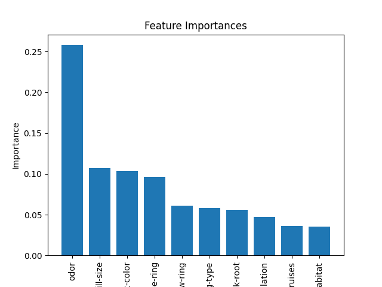
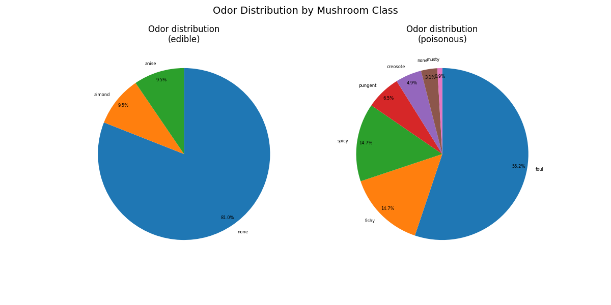
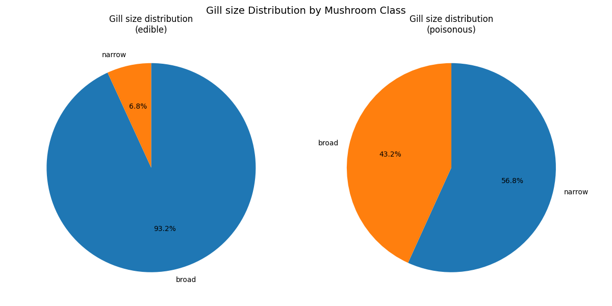

# Mushroom Classification Project Report

## Project Overview

The goal of this project was to build machine learning models capable of **predicting whether a mushroom is edible or poisonous** based on its physical characteristics. The dataset consists of **8124 rows and 23 columns**, with features describing various mushroom attributes such as cap shape, odor, gill color, stalk properties, and habitat.

---

## Dataset Description

- **Target Variable**
  - `class`: edible = `e`, poisonous = `p`

- **Features**
  - `cap-shape`: bell = `b`, conical = `c`, convex = `x`, flat = `f`, knobbed = `k`, sunken = `s`
  - `cap-surface`: fibrous = `f`, grooves = `g`, scaly = `y`, smooth = `s`
  - `cap-color`: brown = `n`, buff = `b`, cinnamon = `c`, gray = `g`, green = `r`, pink = `p`, purple = `u`, red = `e`, white = `w`, yellow = `y`
  - `bruises`: bruises = `t`, no = `f`
  - `odor`: almond = `a`, anise = `l`, creosote = `c`, fishy = `y`, foul = `f`, musty = `m`, none = `n`, pungent = `p`, spicy = `s`
  - `gill-attachment`: attached = `a`, descending = `d`, free = `f`, notched = `n`
  - `gill-spacing`: close = `c`, crowded = `w`, distant = `d`
  - `gill-size`: broad = `b`, narrow = `n`
  - `gill-color`: black = `k`, brown = `n`, buff = `b`, chocolate = `h`, gray = `g`, green = `r`, orange = `o`, pink = `p`, purple = `u`, red = `e`, white = `w`, yellow = `y`
  - `stalk-shape`: enlarging = `e`, tapering = `t`
  - `stalk-root`: bulbous = `b`, club = `c`, cup = `u`, equal = `e`, rhizomorphs = `z`, rooted = `r`, missing = `?`
  - `stalk-surface-above-ring`: fibrous = `f`, scaly = `y`, silky = `k`, smooth = `s`
  - `stalk-surface-below-ring`: fibrous = `f`, scaly = `y`, silky = `k`, smooth = `s`
  - `stalk-color-above-ring`: brown = `n`, buff = `b`, cinnamon = `c`, gray = `g`, orange = `o`, pink = `p`, red = `e`, white = `w`, yellow = `y`
  - `stalk-color-below-ring`: brown = `n`, buff = `b`, cinnamon = `c`, gray = `g`, orange = `o`, pink = `p`, red = `e`, white = `w`, yellow = `y`
  - `veil-type`: partial = `p`, universal = `u`
  - `veil-color`: brown = `n`, orange = `o`, white = `w`, yellow = `y`
  - `ring-number`: none = `n`, one = `o`, two = `t`
  - `ring-type`: cobwebby = `c`, evanescent = `e`, flaring = `f`, large = `l`, none = `n`, pendant = `p`, sheathing = `s`, zone = `z`
  - `spore-print-color`: black = `k`, brown = `n`, buff = `b`, chocolate = `h`, green = `r`, orange = `o`, purple = `u`, white = `w`, yellow = `y`
  - `population`: abundant = `a`, clustered = `c`, numerous = `n`, scattered = `s`, several = `v`, solitary = `y`
  - `habitat`: grasses = `g`, leaves = `l`, meadows = `m`, paths = `p`, urban = `u`, waste = `w`, woods = `d`

---

## Data Preprocessing

**Encoding**  
  Target variable was converted to numeric values using `LabelEncoder`.
  All categorical features were converted into a binary format using One Hot Encoding.

---

## Models Built

Three machine learning models were trained and evaluated:

1. **Random Forest (RF)**
2. **Logistic Regression (Log Reg)**
3. **Support Vector Classifier (SVC)**

**Training Methodology:**
- **Hyperparameter tuning** via Grid Search
- **k-Fold Cross-Validation** to reduce overfitting and ensure reliable results

---

## Results

### 1️⃣ Training Performance

| Model   | Accuracy | Training Time |
|---------|----------|---------------|
| RF      | 100%     | ~94.7 seconds |
| Log Reg | 100%     | ~1.3 seconds  |
| SVC     | 100%     | ~122 seconds  |

### 2️⃣ Test Performance

| Model   | Accuracy |
|---------|----------|
| RF      | 100%     |
| Log Reg | 100%     |
| SVC     | 100%     |

✅ The results indicate **no overfitting**, as training and test accuracies are both 100%.

---

## Feature Importance (Random Forest)

The **most important features** based on Random Forest feature_importances_ parameter were:

1. `odor`  
2. `spore-print-color`  
3. `gill-size`  

These features have the strongest influence on whether a mushroom is classified as edible or poisonous.
The importance of these features was confirmed using chi-squared tests, which yielded extremely small p-values, indicating significant differences between edible and poisonous mushrooms.

The diagram below illustrates the top 10 most important features.

The most important feature in our dataset is odor, which shows a markedly different distribution between edible and poisonous mushrooms. Among edible mushrooms, the majority had no odor, while 9.5% exhibited almond and 9.5% anise odors. In contrast, over half of the poisonous mushrooms had a foul odor, with the remainder displaying fishy, spicy, or pungent odors, and only 3.1% had no odor. This clearly demonstrates the distinct odor patterns between the two groups. The following diagrams present these distributions as pie charts for visual comparison.

The second most important feature, Spore Print Color, also exhibits distinct distributions between edible and poisonous mushrooms. Among edible mushrooms, most are brown, black, or white, whereas in poisonous mushrooms, the majority are white, with notable proportions of chocolate, black, and brown as well. This highlights clear differences in spore print color between the two groups.

Similarly, Gill Size shows different patterns between edible and poisonous mushrooms. For edible mushrooms, most have broad gills, with only 6.8% exhibiting narrow gills. In contrast, over half of the poisonous mushrooms have narrow gills, while fewer than half have broad gills. The following charts present these distributions for visual comparison.

---

## Conclusion

- The models successfully classify mushrooms as **edible or poisonous** with high accuracy.  
- **Logistic Regression** was very fast.  
- Overall, this project demonstrates that mushroom edibility can be accurately predicted using physical features and standard machine learning techniques.
